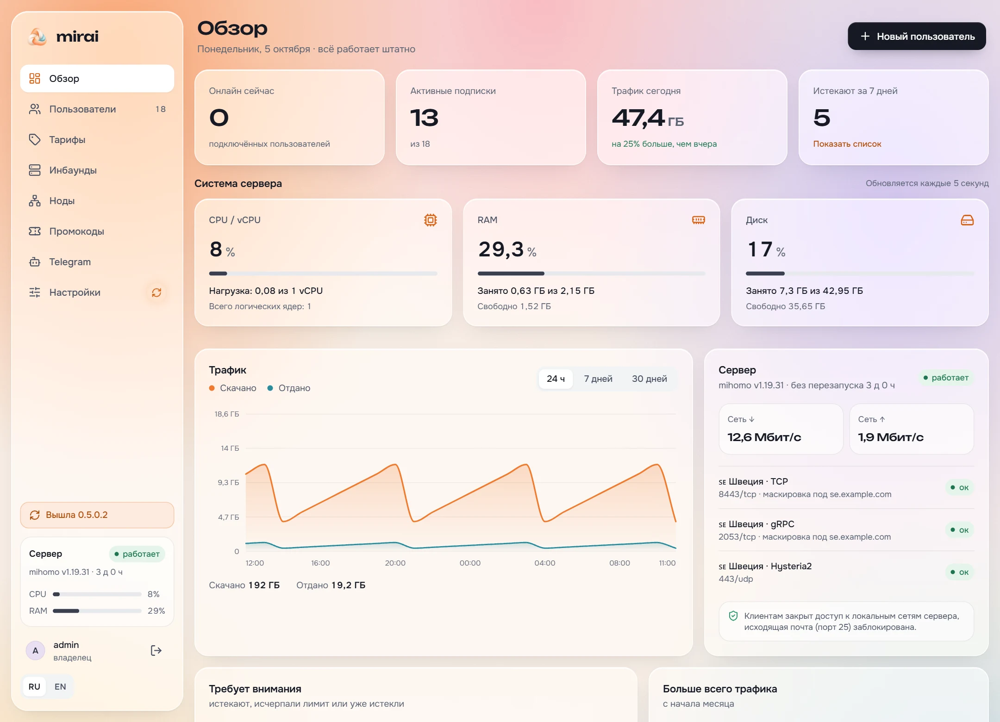
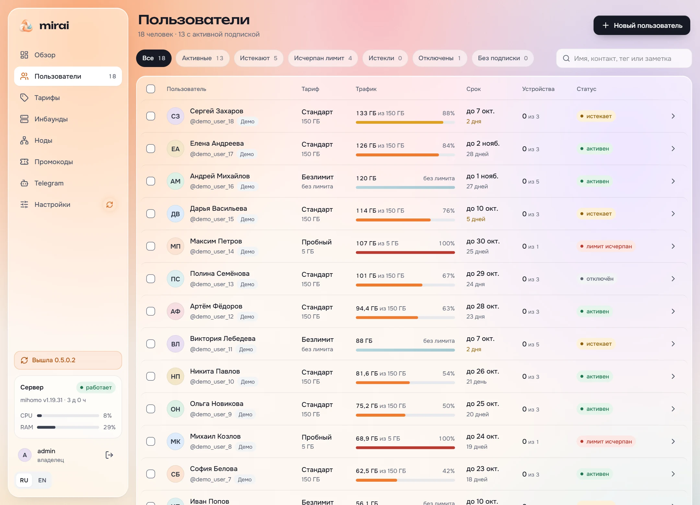

<div align="center">
<picture>
  <source media="(prefers-color-scheme: dark)" srcset=".github/assets/banner-en-dark.svg">
  
</picture>

**A self-hosted VPN panel with subscriptions, Telegram and multi-node management.**

[](https://github.com/EnsixD/mirai/releases)
[](LICENSE)
[](#install)

[Install](#install) · [Screenshots](#screenshots) · [Telegram](#telegram) · [Updates](#updates)
</div>

## Built for everyday administration

Mirai brings VPN infrastructure and subscription management into one interface, powered by the [mihomo](https://github.com/MetaCubeX/mihomo) core.

| Workflow | What Mirai provides |
| --- | --- |
| Monitor | CPU/vCPU, RAM, disk, traffic charts and subscription status |
| Connect | Inbound templates, names with flags and emoji, remote nodes |
| Manage | Traffic limits, devices, extension, freezing and deletion |
| Sell | Plans, a one-time trial, traffic packages, promo codes and built-in YooKassa with separate test/live shops |
| Automate | A built-in Telegram bot with customer and private admin menus |
| Route | Happ and INCY deeplink profiles, plus Clash routing rules |
| Customize | Mirai and Midnight themes, animated modals, draggable bot buttons |

Fresh installations start with **no customers, subscriptions, tariffs, payment credentials or published inbounds**. Default Telegram copy is included; all credentials and service settings belong to the installation owner.

## Screenshots

Current Mirai interface in Russian. These screenshots use an isolated demonstration database: all users, subscriptions, traffic and node metrics shown here are fictional.

### Overview



### Users



## Install

On a fresh **Ubuntu 22.04+ or Debian 12+** server, **amd64 or arm64**:

```sh
curl -fsSL https://github.com/EnsixD/mirai/releases/latest/download/install.sh | sudo bash
```

The native installer installs verified binaries, PostgreSQL and Nginx, then starts the panel and its local VPN node as separate systemd services. **Docker and build tools are not required for the panel or VPN nodes.**

Supply a domain with an A/AAAA record pointing to your server to enable HTTPS. The installer checks DNS and obtains or reuses a Let's Encrypt certificate. Ports 80 and 443 must be reachable. On completion it prints the full panel URL, administrator login and password, and saves them to `/root/mirai-login.txt` with root-only permissions.

For unattended installation:

```sh
curl -fsSL https://github.com/EnsixD/mirai/releases/latest/download/install.sh \
  | sudo bash -s -- --yes --lang en --domain vpn.example.com --email you@example.com
```

Without a domain the panel uses HTTP. Choose a REALITY camouflage target before publishing an inbound. With a domain, new REALITY templates on the local node default to the panel's own HTTPS website. Choose a VPN port that does not conflict with the public panel port.

### Add a remote VPN node

Create a node in the main panel's **Nodes** page and copy its join key. On the remote server:

```sh
curl -fsSL https://github.com/EnsixD/mirai/releases/latest/download/install.sh \
  | sudo bash -s -- --join KEY
```

A remote node runs the VPN core and a certificate-pinned management connection. It **does not run a second admin panel**. Allow the management port shown in the generated command and the VPN ports you publish through your firewall.

### Manage the installation

```sh
mirai status
mirai update
mirai reset-password
journalctl -u mirai -u mirai-node --no-pager -n 100
```

Configuration lives in `/etc/mirai/mirai.env`, runtime data in `/var/lib/mirai`, and verified binaries in `/opt/mirai`. See [native deployment details](scripts/native/README.md).

## Telegram

The bot runs inside the panel. Add a BotFather token and your numeric administrator ID in **Telegram**. Admin actions check that ID on every request.

Upload a PNG or JPEG banner in Telegram settings. The banner stays above one editable screen while users navigate; long instructions are kept in full. Administrator actions notify the account owner about grants, extensions, device limits, access changes, and closed orders. These notices can be disabled in the panel.

```text
/start → VPN description
         🛒 Buy · 🔄 Renew
         👤 Profile · 📖 Instructions
         ⚙️ Admin panel — administrator only

Profile → purchase statistics → 📋 My subscriptions · 🧾 My orders
Renew → choose a subscription → choose a term → payment
My orders → resume payment · verify status · close order
My subscriptions → choose a subscription → details → 📱 Devices (count)
Devices → tap a device to clear it, or 🧹 Clear all
```

Visitors who send `/start` or interact with the bot appear in the panel with their Telegram identity. Telegram does not notify bots when someone merely opens an idle chat.

Customer and admin buttons support drag ordering and deletion, with a consistent compact two-column layout. Texts, notifications, device reset quotas and admin actions are configured in the panel. The selected trial plan appears under **Buy**, can be claimed once per Telegram account, and disappears after use.

The private admin menu includes users, keys, pending orders, broadcasts, maintenance and refresh. Customer cards offer issuing a key, their keys, blocking and deletion; subscription cards expose the connection link, expiry, device cap and connected devices. Destructive actions and broadcasts require confirmation. Maintenance can also be controlled from the panel; it pauses the customer bot menu while subscription access and payment reconciliation continue.

## Connections and routing

The catalog includes **VLESS TCP REALITY**, **VLESS gRPC REALITY**, **VLESS WebSocket TLS**, **VLESS XHTTP REALITY**, **Hysteria2**, **Trojan REALITY**, and an XHTTP post-quantum preset. Custom templates are validated before saving.

WebSocket uses ordinary TLS: REALITY over WebSocket is rejected. Supported XHTTP options reach client profiles; unknown options are rejected. Clash subscriptions include a final reject rule so an unsupported UDP transport cannot silently fall through to DIRECT. Explicit direct-routing rules still apply.

Subscription URLs can use a separate domain and a root path such as `https://subs.example.com/A7b2X9mQ4`. New IDs use configurable random letters and digits, 9–32 characters. Existing links remain valid. Inbound display names preserve emoji and flags in compatible clients.

Traffic for devices bound to distinct HWID slots is displayed in the panel, subscription page and bot. Clients sharing one slot share its counters; this is not an exact per-IP breakdown.

## Updates

Mirai starts at **0.5.0**. Native releases use `native-vX.Y.Z` and include both architectures. The settings icon indicates an available panel update.

The updater verifies an **Ed25519-signed manifest** and archive SHA-256, backs up binaries and PostgreSQL, then restarts services. A failed health check triggers restoration of the saved installation and database. Backups remain in `/var/backups/mirai`. Automatic updates are disabled by default and can be enabled in Settings.

Default service limits are **256 MB** for the panel and **448 MB** for the VPN node. Idle usage is much lower; capacity depends on protocols, traffic and concurrent connections. PostgreSQL, Nginx and the operating system also need memory.

## Development

Mirai uses Go, PostgreSQL, React, TypeScript and Vite. The UI is embedded into the panel binary.

```sh
cd web
pnpm install --frozen-lockfile
pnpm build
cd ..
go build ./cmd/mirai
go build ./cmd/mirai-node
```

The native release workflow compiles all Go packages and runs current Mirai contract and safety tests against PostgreSQL before publishing signed artifacts.

## License and attribution

Mirai is distributed under [GPL-3.0](LICENSE). It is derived from [Mikan](https://github.com/Miroshka000/mikan) and uses [mihomo](https://github.com/MetaCubeX/mihomo). Original copyright notices and license obligations are preserved.
